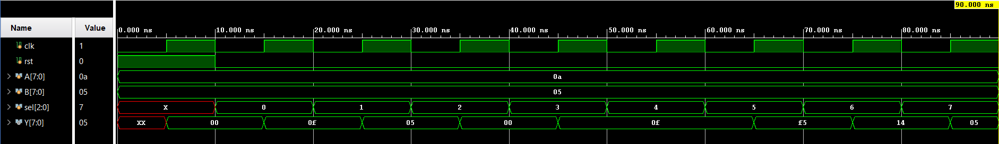
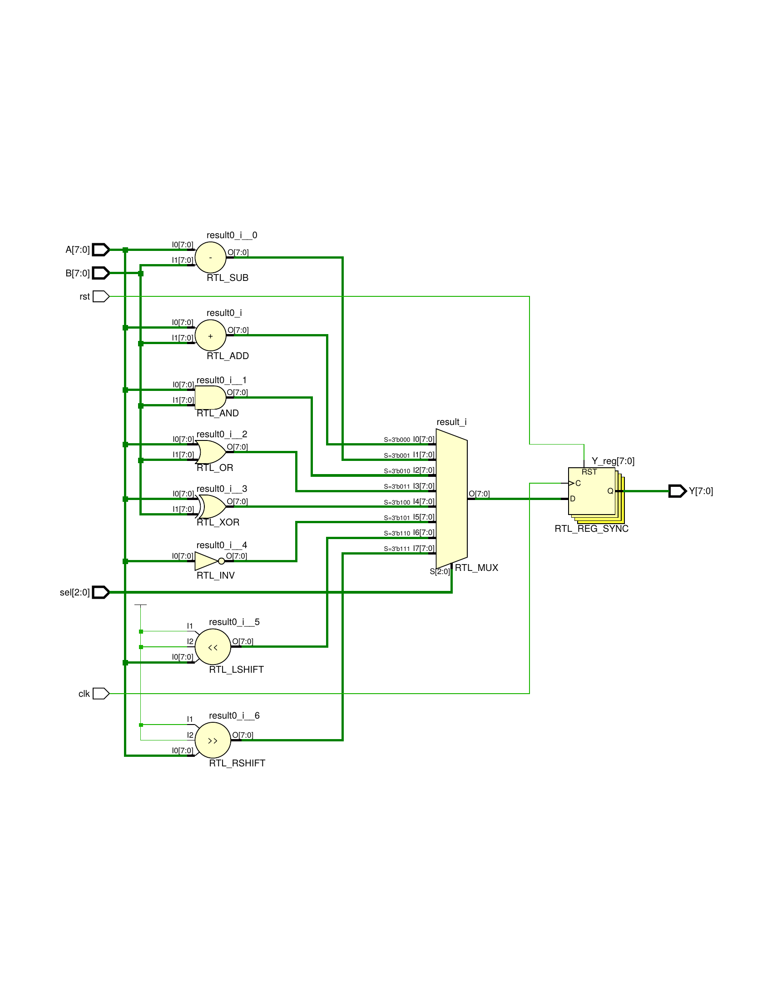

# 8-bit ALU (Verilog)

A synthesizable 8-bit Arithmetic Logic Unit (ALU) designed in Verilog HDL, built and simulated in Xilinx Vivado (2023.2), targeting the Artix-7 (xc7a35tcpg236-1) FPGA.

## Overview

This project implements an 8-bit ALU that performs eight different arithmetic, logical, and shift operations on two 8-bit operands, selected via a 3-bit control signal. The design includes a registered output stage, making it suitable for integration into synchronous digital systems such as processors, datapaths, or custom control logic.

## Features

- 8-bit wide operands (`A`, `B`)
- 8 selectable operations via a 3-bit `sel` control line
- Registered (clocked) output for synchronous designs
- Synchronous active-high reset

## Supported Operations

| sel (binary) | Operation              | Expression |
|:------------:|------------------------|:----------:|
| 000          | Addition                | A + B      |
| 001          | Subtraction              | A - B      |
| 010          | Bitwise AND              | A & B      |
| 011          | Bitwise OR               | A \| B     |
| 100          | Bitwise XOR              | A ^ B      |
| 101          | Bitwise NOT              | ~A         |
| 110          | Logical Shift Left      | A << 1     |
| 111          | Logical Shift Right     | A >> 1     |

## Repository Structure

```
ALU_8bit_Verilog/
├── src/
│   └── alu_8bit.v          # RTL design
├── sim/
│   └── tb_alu_8bit.v       # Testbench
├── docs/
│   ├── waveform.png        # Simulation waveform screenshot
│   └── schematic.png       # Elaborated RTL schematic
├── README.md
├── .gitignore
└── LICENSE
```

## Module Interface

| Signal | Direction | Width | Description                    |
|--------|-----------|:-----:|---------------------------------|
| clk    | input     | 1     | Clock signal                    |
| rst    | input     | 1     | Synchronous active-high reset   |
| A      | input     | 8     | First operand                   |
| B      | input     | 8     | Second operand                  |
| sel    | input     | 3     | Operation select                |
| Y      | output    | 8     | Registered ALU result           |

## How to Simulate

### Using Vivado
1. Create a new RTL project in Vivado.
2. Add `src/alu_8bit.v` as a design source.
3. Add `sim/tb_alu_8bit.v` as a simulation source.
4. Run **Behavioral Simulation** and observe the waveform in the simulation window.

### Using Icarus Verilog (free, open-source alternative)
```bash
iverilog -o alu_sim src/alu_8bit.v sim/tb_alu_8bit.v
vvp alu_sim
```

## Simulation Waveform

`sel` is swept through all 8 operation codes (0–7) with fixed operands `A = 0x0a`, `B = 0x05`. Because the ALU output `Y` is registered, each result appears on the clock edge following the corresponding `sel` value, demonstrating correct synchronous behavior across every operation.



## RTL Schematic

Elaborated RTL view showing all eight operations (SUB, ADD, AND, OR, XOR, INV, LSHIFT, RSHIFT) computed in parallel, feeding into a `sel`-controlled multiplexer, with the selected result captured in a synchronous output register (`Y_reg`):



## Target Device

- **Part:** xc7a35tcpg236-1 (Artix-7, Basys 3 / Arty A7-compatible)
- **Tool:** Xilinx Vivado 2023.2

## Possible Extensions

- Add a carry-out / overflow flag for arithmetic operations
- Add a zero flag for branch/comparison logic
- Pipeline the design for higher clock frequencies
- Wrap into a larger datapath with an instruction decoder

## Author

**Devam Patel**
M.Tech — VLSI & Embedded Systems

## License

This project is licensed under the MIT License — see the [LICENSE](LICENSE) file for details.
